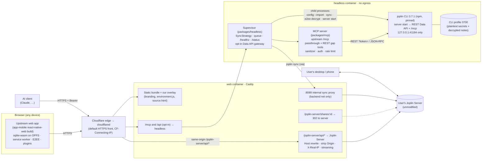
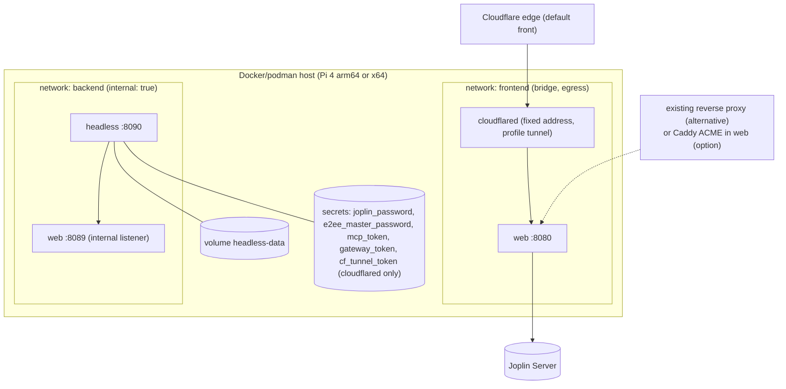

# Architecture: Notestead for Joplin (unofficial), a self-hosted web app, Data API and MCP stack

Status: **Approved** at gate 1 on 2026-10-04 (tag `plan-approved-v1`), with the gate 1 amendments applied the same day (§14: Cloudflare Tunnel front, the name Notestead, versioning rule D7, the user's versions). Proposed in Phase A / M0, 2026-10-03 (architect).

Upstream reference: laurent22/joplin `release-3.7` @ `e41516e66` (tag `v3.7.21`), npm `joplin@3.7.1` (`cli-v3.7.1` = `425a05ac4`), `joplin/server:3.7.2` (`server-v3.7.2`). Citations look like `upstream:<path>:<line>` and point into `~/joplin-web-app-work/upstream-joplin`.

---

## 1. Context, goals and non-goals

**Context.**
- The user runs a self-hosted **Joplin Server** with **E2EE enabled**, plus Joplin desktop and mobile clients (3.7.x).
- They want, on their own hardware (Raspberry Pi 4 arm64 today, x64 elsewhere):
  1. **Web UI:** the real Joplin UI in a browser, syncing with their existing server, with installable plugins.
  2. **Headless Data API:** the same REST Data API that the desktop app exposes, kept in sync and decrypted.
  3. **MCP server:** AI clients can manage notes, to-dos with alarms, notebooks and tags, reorganise them and trigger sync.
- **Public distribution** of the stack (images, an npm MCP package, the bundle) is also a goal, under the public name **Notestead** ("Notestead for Joplin (unofficial)"). The channels are chosen in `docs/delivery/channels.md` (approved at gate 1); artifact names are in ADR-0006.
- **The HTTPS front is Cloudflare Tunnel** (gate 1): `cloudflared` → the `web` container (ADR-0006, S6).

**Goals.**
- G1. Reuse upstream components through published or documented interfaces. **No fork.** Zero source patches today.
- G2. Stay correct as Joplin updates. Every upstream interface we consume has a test that detects drift (§6).
- G3. arm64 and x64 are first-class.
- G4. Never endanger the user's existing data or devices:
  - no `syncVersion` changes
  - no server-side changes
  - tests never touch the real server
- G5. Secure by default (§5): E2EE secrets, the Data API token, LLM-controlled input, the file:// exfiltration path.
- G6. Simple: two small containers, one compose file (plus the optional `cloudflared` container for the tunnel front).

**Non-goals.**
- Modifying or replacing Joplin Server, or hosting it.
- Joplin Cloud as a sync target.
- Re-implementing the Joplin UI or the Data API.
- Alarm notifications in the browser (an upstream limitation, L1).
- Background sync while no browser tab is open (L3). The headless service syncs independently.
- Running desktop-only plugins.

## 2. Components



| Component | What it is | Ours or upstream | ADR |
|---|---|---|---|
| Web UI | `packages/app-mobile` `yarn web` output, unmodified, plus a static overlay | upstream (built by us from the pinned commit) | 0001, 0010 |
| `web` container | Caddy: static files, same-origin proxy, internal sync proxy, opt-in `/mcp` and `/api` routes | ours (config only) | 0002, 0006 |
| `headless` container | Node supervisor running the pinned CLI through public commands | ours (supervisor) + upstream (CLI) | 0003 |
| MCP server | `@modelcontextprotocol/sdk` server. Passes allow-listed upstream `/mcp` tools through, and adds REST gap tools. | ours + upstream tools | 0004 |
| Data API client | typed client for the documented REST API, with guards | ours | 0004, 0008 |
| `cloudflared` (optional, compose profile `tunnel`) | Cloudflare's official tunnel connector, pinned by digest; the default HTTPS front | third party (not Joplin) | 0006, 0008 |

## 3. Deployment topology (x64 and arm64)

The same compose file runs on both architectures. The images are multi-arch manifests. Both images are built natively per architecture. The web bundle inside the `web` image is **architecture-neutral** and built once on x64 (ADR-0001; S1).



- **Only `web` publishes a port** (default `127.0.0.1:8080`; with the tunnel, only for local use). Only `web` and `cloudflared` have egress, and `cloudflared` has no route to `backend`.
- **`headless` sits on an `internal` network.** Its only route out is `web:8089`, which forwards only `/joplin-server/api/*` to the configured server (ADR-0006).
- **No pod:** a shared localhost would expose the CLI's `127.0.0.1:41184` to `web`.
- **TLS (gate 1): Cloudflare Tunnel by default.** `cloudflared` sits on `frontend` at a fixed address and routes the public hostname to `web:8080`; `web` trusts `CF-Connecting-IP` only from that address. The existing reverse proxy is the documented alternative, and Caddy ACME an option. For use on a single machine, `http://127.0.0.1:8080` is a secure context and needs no TLS. A private CA is unsupported (phones).
- **`JOPLIN_SERVER_URL` is a direct address** of the user's server (LAN or container network), never a Cloudflare-proxied hostname (ADR-0002).
- **Resources measured on the Pi:**
  - `web` (Caddy) ~12 MB RSS
  - `headless` 84–109 MB for the container (the CLI `server start` process is 134–165 MB RSS), with brief single-core peaks during sync and decrypt (S3)
  - throwaway `joplin/server` (tests only) 213 MB
- **Image builds:** native per architecture in CI (ci-cd-specialist). The bundle is built once on x64.
  - Native on the Pi: the install phase alone took 33.6 min, with a 7.0 GiB peak system memory and 2 GiB of swap fully used. The webpack phase added 8.6 min with a 3.9 GiB RSS peak, and the clone plus `node_modules` used ~13 GB of disk (S1).
  - Local Pi builds are therefore a fallback, not the release path.

## 4. Data and sync flows (including E2EE)

**Browser.**
1. The user opens `https://<host>/` (Cloudflare edge → cloudflared → `web`), and the service worker installs (COOP/COEP pass through Cloudflare unchanged, S6).
2. The user picks the "Joplin Server" sync target with URL `https://<host>/joplin-server` and their credentials.
3. Upstream's sync client calls `/joplin-server/api/*`. Caddy forwards to the server with the Host rewritten (S2 C1–C3).
4. Items arrive encrypted. The app asks for the master password and decrypts them in the browser (WebCrypto).
5. Plaintext lives only in OPFS on that device.
6. Local edits are encrypted before upload.
7. Sync runs only while the tab is open.

**Headless sync cycle (stop-the-world, ADR-0003).**

```mermaid
sequenceDiagram
  autonumber
  participant T as Trigger (timer / write debounce / sync_now)
  participant S as Supervisor
  participant C as joplin CLI (child)
  participant W as web :8089
  participant J as Joplin Server
  T->>S: requestSync()
  S->>S: take mutex, queue new API calls, drain in-flight
  S->>C: SIGTERM "server start"
  S->>C: joplin sync
  C->>W: /joplin-server/api/* (encrypted items)
  W->>J: Host rewritten
  S->>C: joplin e2ee decrypt --force  (uses encryption.masterPassword)
  S->>C: config --import {api.token: fresh}; server start --quiet
  C-->>S: /ping OK (search index refreshed at startup)
  S->>S: release queue
```

The measured outage per cycle on the Pi is **~16–19 s** for small deltas: three CLI starts at ~4.5 s each, plus sync and decrypt. Search becomes fresh ~10 s after the restart. Requests that arrive during a cycle are queued (S3).

**MCP write → user's devices.**
1. The AI client calls `create_todo` (title, due date, notebook, tag).
2. The MCP server sanitizes the body and calls REST: `POST /notes` with metadata only, `PUT` with the body, then the tags.
3. The CLI encrypts the item at the next sync (E2EE is on for the account; S3).
4. The supervisor debounces a cycle (30 s).
5. The item reaches the server, encrypted.
6. The user's desktop or phone syncs, decrypts, and **schedules the alarm locally**. Alarms are per device and not synced. The web app never fires them (L1).

**Device write → MCP read.**
1. The device syncs to the server.
2. The next headless cycle (timer, or `sync_now`) syncs, decrypts and restarts the API (which refreshes the search index).
3. `read_note` and `search_notes` see the change.

**Integrity rules.**
- No automation runs `sync --upgrade`.
- The supervisor refuses a CLI whose `syncVersion` differs from the pin (3).
- Sync-target `info.json` version `3` is asserted unchanged in tests (S4 §B).

## 5. Security model (summary of ADR-0008)

| Threat | Control | Test |
|---|---|---|
| LLM-written `` makes `POST /notes` copy the profile DB (plaintext secrets) into a resource that syncs out (`upstream:packages/lib/services/rest/routes/notes.ts:518, 278-280`; reproduced in S4 M10) | Our code never sends bodies to `POST /notes` (metadata POST + `PUT` body). A body sanitizer rejects `file:`/`data:`/`http:`/`javascript:` targets. Attachments take content, never paths. The headless service has no egress except to the Joplin Server. The opt-in gateway rejects `file:` in `POST /notes`. | M4-AC7/8, M3-AC10/12 |
| Data API token leaks (query string; logged in full by `ClipperServer.ts:215` into `log-clipper.txt`, shown in S3) | The CLI port never leaves the container namespace. The token is rotated on every CLI start. `--quiet`, plus redaction of relayed lines, plus truncation of `log-clipper.txt`. External clients use separate MCP/gateway tokens. | M1-AC17, M3-AC8 |
| Secrets at rest (Linux: plaintext in the profile DB) | Secrets come from podman secrets, are piped through `config --import` on stdin (never argv or env), the volume is `0700` and non-root. Encrypted disk is recommended. A least-privilege bot account is offered as an option (Q8). | M1-AC14, M3-AC7 |
| Prompt injection → destructive actions | Trash by default. Permanent delete needs `MCP_ALLOW_PERMANENT_DELETE` and carries `destructiveHint`. Read-only mode. Rate limits. An audit log without content. | M4-AC9/10/17 |
| MCP endpoint exposure / DNS rebinding | Bearer token ≥ 32 bytes, `Origin` allow-list, TLS via the front, off the host by default | M4-AC2 |
| Proxy abuse / limiter bypass | Only `/joplin-server/api/*` is proxied. `X-Real-IP` is overwritten with the real client IP, taken from `CF-Connecting-IP` only when the peer is cloudflared, else from the TCP peer. Server UI is not re-published. | M1-AC10/11 (S2 R1–R4, S6 R5-neg) |
| TLS terminated by Cloudflare (gate 1) | Stated plainly (L17): Cloudflare sees the web login, session ids, the MCP bearer token and decrypted MCP results; sync payloads stay E2EE. `MCP_PUBLIC=false` keeps MCP host-local for users who don't accept it. Tunnel token from a podman secret; optional Access service token on `/mcp`; bearer token stays mandatory. | M5-AC13, M5-AC11 |
| Front caches or rewrites the app | `Cache-Control: no-cache, no-transform` on static files, `no-store, no-transform` on API/MCP; zone checklist (Rocket Loader, Bot Fight Mode, challenges off) | M1-AC10 C10, M1-AC12, M5-AC11 |
| User content on the app origin (XSS → OPFS secrets) | Published notes redirect to the server origin. The upstream CSP stays intact. Nothing else is served on the origin. | M2-AC14 |
| Supply chain | Pinned commit, lockfile, image digests, SBOM, provenance, signing (ci-cd), `check:no-upstream-copy`, licence allow-list | M1-AC4, M5-AC4/5 |

## 6. Upstream reuse map

| # | Our component | Upstream artifact (pinned) | Interface consumed | Stability of that interface | What breaks on upgrade | Detection (test) |
|---|---|---|---|---|---|---|
| 1 | Web UI | app-mobile web build, `release-3.7` @ `e41516e66` (`v3.7.21`; app-mobile code identical to `android-v3.7.11`) | Official build recipe (`corepack yarn install`; `cd packages/app-mobile && yarn web`); `web/dist` layout; static files `environment.js`, `manifest.json`, `icons/*`, `index.html`, `just-one-client.html`, `closed.html` | **Medium-low.** The bundle isn't a published artifact and upstream doesn't test it, but the recipe has been stable in github.com/joplin/web-app. | New build steps or Node/yarn requirements; renamed static files (overlay); new header requirements | `web-bundle.yml` build; overlay expected-file check (M1-AC6, M6-AC5); M2 E2E suite |
| 2 | Browser ↔ server sync | Upstream sync client in the bundle (`lib/JoplinServerApi.ts`, `Synchronizer.ts`) | Joplin Server sync API under `api/*`, `X-API-AUTH`, `X-API-MIN-VERSION: 2.6.0` | **High.** Shared by every Joplin client. | A path outside `api/` (proxy 404s it); a change in the auth scheme | M2-AC1; proxy contract C1–C3 |
| 3 | Same-origin proxy | Joplin Server behaviour (any 3.x, unmodified) | Host-based `isValidOrigin`; hard-coded CORS; `X-Real-IP` trust in `userIp()`; `/shares/:id` route | **Medium.** Internal and undocumented, but long-standing. | Server starts honouring `X-Forwarded-Host` (harmless) or stops trusting `X-Real-IP` (limiter keying changes); share URL scheme changes | Proxy contract suite with negative controls C1-neg and R1–R4 (M1-AC10/11), M2-AC14 |
| 4 | Headless runtime | npm `joplin@3.7.1`, lockfile-pinned `@joplin/lib`/`renderer`/`utils` 3.7.1 | CLI commands `config --import`, `sync`, `e2ee decrypt --force`, `server start --quiet`, `version`; files `clipper-pid.txt`, `settings.json`, `log-clipper.txt` | **Medium.** The commands are documented (`joplin help`), but `server` is labelled experimental. | Flags or commands change; startup cost; log format (redaction) | Headless contract suite M3-AC3–16; integration M1-AC14–17 |
| 5 | Headless configuration | `@joplin/lib` settings metadata | `sync.target`, `sync.9.path/username/password`, `encryption.masterPassword`, `api.token`, `api.port`, `mcp.enabled`, `ai.tool.<id>.enabled` | **Medium.** `sync.*` has been stable for years. `mcp.*`/`ai.*` are new in 3.7 (beta). | Renamed or removed keys | M1-AC14, M3-AC16, M4-AC3 |
| 6 | REST Data API (MCP gap tools, gateway) | `ClipperServer` + `Api` inside the CLI | Documented routes (`upstream:readme/api/references/rest_api.md`): `/notes`, `/folders`, `/tags`, `/resources`, `/search`, `/revisions`, `/ping` | **High.** Documented, and used by the web clipper and plugins. | Field or route changes, pagination | `rest-shape` snapshots (M6-AC3); M3-AC11; M4 contract |
| 7 | MCP passthrough | Upstream `/mcp` (3.7, beta), `McpServer.ts`, `ToolIndex.ts` | JSON-RPC `initialize`/`tools/list`/`tools/call`; tool names and input schemas | **Low.** Beta, all off by default, the spec and code disagree on defaults. | Tool renames or schema changes; settings keys | `mcp-upstream` snapshot (M4-AC4); automatic REST fallback |
| 8 | Version safety | `syncVersion: 3` (`upstream:packages/lib/models/Setting.ts:306`) | constant | **High, and critical.** | A bump upgrades the user's sync target and locks older devices out | `check:pin`; M3-AC9; M6-AC2 |
| 9 | Test server | `docker.io/joplin/server:3.7.2` | `node dist/index.js --env dev --env-file /dev/null`; `POST /api/debug` (`createTestUsers`, `clearDatabase`); `GET /api/ping`; `JOPLIN_IS_TESTING` | **Medium-low.** Test hooks, undocumented; the image CMD ignores `APP_ENV` (S2). | The harness can't seed | Harness self-tests M1-AC18–20 |
| 10 | Plugins on web | Plugin API inside the bundle; plugin repo `github.com/joplin/plugins` | `.jpl` format; manifest `platforms` includes `mobile` | **Medium** | Web plugin API gaps change | M2-AC9/10 |
| 11 | HTTPS front (third party, not Joplin) | `docker.io/cloudflare/cloudflared` (2026.9.3 at S6), pinned by digest, plus Cloudflare's edge | `CF-Connecting-IP`; plan body limits (Free/Pro 100 MB); 524 after 125 s; zone defaults (caching by extension, Email Obfuscation) | **Medium.** Documented, but limits and defaults change on Cloudflare's schedule. | Limits/timeouts tighten; a new default transformation | M1-AC11/12 (our side of the contract); M5-AC11 zone checklist on the real tunnel |

## 7. Version skew, upgrade and rollback (summary of ADR-0005)

- **One pin file** (`upstream/joplin-version.json`): web commit and tag, CLI version, server test tag, `minor`, `syncVersion`. `yarn.lock` pins the CLI's transitive `@joplin/*`.
- **Skew:**
  - All artifacts stay on the **same minor** as the user's server and clients (3.7).
  - Patches may differ (web 3.7.21 vs CLI 3.7.1 is allowed).
  - `syncVersion` must be equal everywhere (3).
- **Upgrades:**
  - Patch bumps come as automated PRs gated by the full suite on both architectures (M6).
  - A minor bump happens only after the user confirms that their server and clients are on that minor, with an ADR amendment.
  - **Our version (D7, gate 1):** one lockstep semver for all artifacts. An upstream patch is our PATCH; a Joplin minor upgrade is our **MAJOR** (MINOR while 0.x) and moves the floating `joplin<minor>` image tag (ADR-0006).
- **Rollback:**
  - Image digests are immutable. The headless profile is snapshotted before a CLI version change (last 3 kept).
  - The browser database migrates forward only: roll back, then "clear site data" and re-sync. Unsynced local edits, local E2EE password entry and plugins are lost.
  - The user's server is never touched.

## 8. Test strategy (summary of ADR-0007)
- **Unit:** Jest, mock Data API module, fake timers.
- **Integration:** a real CLI child process on a temp profile.
- **Contract:** a throwaway `joplin/server` container ↔ `web` proxy ↔ `headless` ↔ MCP, with snapshots of REST shapes and the upstream `tools/list`.
- **E2E:** Playwright in Chromium against the `web` container, with a fresh context and OPFS per test and data assertions through REST/MCP.
- **Everywhere:** negative controls, `expect.poll`, no sleeps, logs attached.
- **Where it runs:** Pi with 1 worker; CI on `ubuntu-24.04` and `ubuntu-24.04-arm`.

## 9. Known limitations (stated plainly)

- **L1.** The web app never fires **alarm notifications**. `AlarmServiceDriver.web.ts` is a no-op. Due dates are stored and synced, and alarms fire on your desktop or phone after they sync.
- **L2.** **Plugins on web:**
  - Only plugins whose manifest lists `mobile` can be installed.
  - Web lacks `views.menus`/`menuItems`/`noteList`, `joplin.fs`, `joplin.require` native modules, `joplin.imaging`, `dialogs.showOpenDialog` and `joplin.ai`.
  - Your repeating-todos plugin installs, but its menu entry is missing on web.
- **L3.** **One tab per browser profile** (the second tab is redirected). The web app syncs **only while a tab is open**.
- **L4.** **Browser storage holds plaintext.** The browser's OPFS holds your decrypted notes, your sync password and the E2EE password state. Protect devices accordingly. "Clear site data" logs you out and deletes them.
- **L5.** **Web database upgrades are one-way.** Rolling back to an older web bundle requires clearing site data and re-syncing.
- **L6.** **Headless search lag.** Search sees notes created through REST/MCP only after the next headless sync cycle. The CLI doesn't index in command mode; a cycle follows writes within ~30 s.
- **L7.** **The headless API pauses during each sync cycle** (default every 5 min, plus ~30 s after AI writes). Requests wait rather than fail. Measured outage: ~16–19 s per cycle on the Pi (S3), i.e. ~5–6 % of the time at the default interval.
- **L8.** **No plugins in headless.** The headless CLI runs no plugins, OCR, semantic search, or revision creation. Revisions made on your devices are listed but can't be restored through MCP.
- **L9.** **Published-note links** created in the web app redirect to your server's public URL. They only work where that URL is reachable.
- **L10.** **Only self-hosted Joplin Server** is supported as the sync target of this deployment. Other upstream targets would need their own CORS proxies and are out of scope. Joplin Cloud is not supported.
- **L11.** **Browser support:**
  - Chromium-family browsers are the reference.
  - Safari (no COEP `credentialless`) runs in `require-corp` mode, where external images without CORP headers don't load.
  - Firefox is smoke-tested only.
  - A secure context (HTTPS, or `127.0.0.1` locally) is required.
- **L12.** **MCP restrictions:** remote images and links in AI-written bodies are refused by default, tag deletion and permanent deletes are off by default, and revision restore is unsupported.
- **L13.** **Upstream MCP is beta.** Its tools can change between patch releases. Snapshot tests make this visible, and the REST fallback keeps tool names stable.
- **L14.** **The first web login adds upstream's welcome notebook** ("0. About the web app" … "5. Joplin Privacy Policy") to your account (S4). Delete it once if you don't want it. Upstream gives no option to skip it.
- **L15.** **The web app checks connectivity against `https://joplinapp.org/connection_check/`.** It's an upstream behaviour (S4). Under cross-origin isolation the request fails harmlessly, but the attempt is visible to your network and possibly to joplinapp.org.
- **L16.** **Attachment size through Cloudflare.** Cloudflare's Free and Pro plans accept request bodies up to 100 MB (Business 200 MB). With E2EE, an attachment grows ≈ 1.34× when encrypted, so the **web app** can upload attachments up to ≈ 74 MB on Free/Pro. Larger ones show as "cannot sync" in the web app's sync status, and the rest of the sync continues. Desktop and mobile sync directly with your server and are unaffected; so is the headless service.
- **L17.** **Cloudflare sees your plaintext web traffic.** Cloudflare terminates TLS for the tunnel, so it can see the web login (your Joplin Server password), session ids, the MCP bearer token and the **decrypted notes that MCP returns**. Note content in sync stays end-to-end encrypted. If that's not acceptable for MCP, keep `MCP_PUBLIC=false` and use MCP only on the host, or use your own reverse proxy instead of the tunnel.

## 10. Upstream-first ledger
Each shim we carry has an upstream change that would remove it. Filing uses the user's GitHub account (Q11, approved at gate 1; U2 and U5 go privately through Joplin's security policy):

| # | Proposal | Removes |
|---|---|---|
| U1 | Joplin Server: `CORS_ALLOWED_ORIGINS` env | the proxy requirement for users who prefer direct access |
| U2 | Joplin Server: trust `X-Real-IP`/`X-Forwarded-For` only from configured proxies | the limiter-bypass risk for every proxied server (S2 R3) |
| U3 | CLI: honour `sync.interval` + decryption worker + search indexing while `server start` runs (or a `--sync-interval` flag) | stop-the-world outage (L6, L7) |
| U4 | CLI/lib: `api.bindHost`; accept the token in an `Authorization` header; redact `token=` in the `ClipperServer` request log | token-in-URL risks, log redaction shim |
| U5 | lib: restrict `POST /notes` media download protocols (no `file:` for API callers by default) | the file:// guard (ADR-0008) |
| U6 | MCP: tools for `todo_due`/alarms, notebook/tag rename/move/delete, attachments, trash restore, sync | most REST gap tools (ADR-0004) |
| U7 | app-mobile web: runtime config hook (prefilled server URL, branding) and a non-`localhost` dev-mode switch | the `environment.js` overlay |
| U8 | Web: alarm notifications through the Notifications API/service worker | L1 |
| U9 | Build: a supported standalone `yarn web` path, or the web bundle published as a release asset | our x64 bundle build (ADR-0001) |
| U10 | REST: an endpoint that reconstructs a note at a given revision | L8 revision restore |
| U11 | CLI bug: `joplin e2ee enable --password` doesn't persist the master key in command mode (3.7.1; S3) | the `batch` workaround in the test fixture |
| U12 | Web: a configurable or disable-able connectivity-check URL; skip welcome notes when the sync target already has data | L14, L15 |

## 11. Spike results (M0)

| Spike | Result | One line |
|---|---|---|
| S1 web bundle build on arm64 | GO-WITH-CONDITIONS (native, as a fallback); GO for the x64 CI artifact path | The official recipe builds on the Pi unmodified: 43 min, a 7.0 GiB peak with swap full, 13 GB of disk. The output (29 MB) is static and matches the official deployment. Releases use one x64 CI build. |
| S2 same-origin proxy | GO-WITH-CONDITIONS | Unmodified server 3.7.2 works through Caddy. The Host rewrite and the `X-Real-IP` overwrite are mandatory (negative controls prove it). 100 MiB streams with Caddy at 11 MB RSS. Share links redirect. |
| S3 headless sync on arm64 | GO-WITH-CONDITIONS (stop-the-world); NO-GO (TUI under a PTY as the default) | The CLI 3.7.1 installs with prebuilt arm64 binaries. Non-interactive E2EE decrypt works. Settings stay intact. Egress is confined by an `--internal` network. The outage is ~16–19 s per cycle, and search is fresh 10 s after restart. Requires `--init` (zombie hang found) and token rotation (the token is in `log-clipper.txt`). |
| S4 browser + MCP | A GO; B GO-WITH-CONDITIONS; C GO-WITH-CONDITIONS | Chromium on the Pi is cross-origin isolated with OPFS in both COEP modes. The browser syncs through the proxy and completes the E2EE round trip both ways; `info.json` stays at v3. Upstream `/mcp` works headless once enabled through `config`. REST `POST /notes` copying a local `file:` into a resource is reproduced. |
| S5 compatibility | GO-WITH-CONDITIONS, **GO after gate 1** | `syncVersion` is 3 in every pinned ref. Web 3.7.21 / CLI 3.7.1 / server 3.7.2 are mutually compatible. The user confirmed server and clients on 3.7.x and one master password for all keys. |
| S6 Cloudflare Tunnel front (gate 1) | GO-WITH-CONDITIONS | COOP/COEP/CORP pass through; `CF-Connecting-IP` is reliable and unspoofable when trusted only from cloudflared's address; Email Obfuscation rewrites HTML unless `no-transform`; body limit 100 MB on Free/Pro (≈ 74 MB E2EE attachments from the web app; 413 → per-item "cannot sync"); 524 after 125 s. |

## 12. Decisions (ADRs)

| ADR | Title |
|---|---|
| [0001](../adr/0001-web-ui-upstream-app-mobile-web-build.md) | The web UI is upstream's app-mobile web build, built from a pinned ref on x64 CI, consumed as an architecture-neutral artifact |
| [0002](../adr/0002-same-origin-proxy-to-joplin-server.md) | Same-origin reverse proxy from the web origin to the user's Joplin Server |
| [0003](../adr/0003-headless-cli-supervisor-and-sync-strategy.md) | Headless Data API = pinned `joplin` CLI under a Node supervisor, with a pluggable `SyncStrategy` (default: stop-the-world) |
| [0004](../adr/0004-mcp-server-design.md) | MCP server: our own endpoint over the REST Data API, with an allow-listed passthrough to upstream `/mcp` |
| [0005](../adr/0005-version-pin-and-upgrade-policy.md) | One version pin, same-minor skew policy, upgrade and rollback rules |
| [0006](../adr/0006-container-topology-tls-and-artifact-versioning.md) | Container topology, networking, TLS and artifact versioning (channels: `docs/delivery/channels.md`) |
| [0007](../adr/0007-test-strategy-and-harness.md) | Test strategy and harness |
| [0008](../adr/0008-security-model.md) | Security model: secrets, Data API token, file:// download guard, MCP exposure |
| [0009](../adr/0009-repository-layout-and-tooling.md) | Repository layout and tooling |
| [0010](../adr/0010-branding-overlay-and-source-offer.md) | Branding overlay (trademark) and AGPL source offer |

## 13. Delivery plan and ownership

| Milestone | Theme | Main owners |
|---|---|---|
| [M1](../backlog/M1.md) | Walking skeleton and harness (REST note → web UI, on the Pi; CI workflows ready) | SE, QA, CI |
| [M2](../backlog/M2.md) | Web app coverage, branding overlay, source offer | QA, SE |
| [M3](../backlog/M3.md) | Headless service: sync loop, E2EE, secrets, gateway, egress | SE, QA |
| [M4](../backlog/M4.md) | MCP: passthrough, gap tools, guards, cross-surface E2E | SE, QA |
| [M5](../backlog/M5.md) | Release: pre-publish gate, multi-arch images, release workflow, deploy docs, user smoke test | CI, SE, QA, user |
| [M6](../backlog/M6.md) | Upgrade automation: bump PRs and gates, minor procedure, upstream-first ledger | CI, SE, architect |

SE = senior-engineer (`packages/**`, `deploy/**`, `upstream/**`, `patches/**`); CI = ci-cd-specialist (`.github/**`, `packaging/**`, release config, `docs/delivery/**`); QA = qa-specialist (`tests/**`, `docs/test-plans/**`).

## 14. Gate 1: decision log and open questions
The user approved the plan on 2026-10-04 (tag `plan-approved-v1`) with the recommended defaults. Answers are recorded in `docs/backlog/STATUS.md`.

### 14.1 Decision log: resolved at gate 1

| # | Question (Phase A) | Resolved at gate 1 | Applied in |
|---|---|---|---|
| Q1 | Public name, icon, trademark | **Notestead**, shown as "Notestead for Joplin (unofficial)"; our own icons; the "unofficial, not affiliated" notice everywhere. The trademark check is still open (O1). The Phase A advice to keep the repo private is superseded by D3. | ADR-0006 (artifact names), ADR-0010, M5 |
| Q2 | TLS front | **Cloudflare Tunnel** (`cloudflared` → `web`). The existing reverse proxy stays documented as the alternative. | ADR-0002, ADR-0006, ADR-0008, S6, L16, L17, M1-AC10–12, M5-AC9/11/13 |
| Q3 | The user's Joplin Server | **3.7.x.** Its `APP_BASE_URL`, a direct `JOPLIN_SERVER_URL`, `USER_CONTENT_BASE_URL` and the Cloudflare plan are deploy-time configuration, collected in M5-S4. | S5 (resolution), M5-S6 prerequisites |
| Q4 | Clients and E2EE keys | **All clients on 3.7.x; one master password unlocks all keys.** | S5 (resolution), ADR-0005 |
| Q5 | GitHub push, visibility, runners | Repo stays **public** and is renamed to `TheScriptingGuy/notestead` before the first push (D3); GitHub-hosted `ubuntu-24.04` + `ubuntu-24.04-arm`. The rename and push themselves still need approval (O2). | channels.md, M1-S3/S8 |
| Q6 | Headless sync outage | **Accepted** (~16–19 s per cycle; requests wait). | ADR-0003, L7 |
| Q7 | Exposure | **MCP on behind TLS** (now the tunnel) with a ≥ 32-byte bearer token and an Origin allow-list; **REST gateway off.** With the tunnel, L17 applies to MCP traffic. | ADR-0004, ADR-0008 |
| Q8 | Account model | **The full account.** | ADR-0008 |
| Q9 | MCP safety defaults | **Permanent delete and remote links off; time zone `Europe/Amsterdam`.** | ADR-0004, ADR-0008 |
| Q10 | Welcome notes on first web login | **Accepted once** (L14). | — |
| Q11 | Upstream contributions | **Yes**; U2 and U5 go **privately** through Joplin's security policy. | §10 |
| Q12 | Pi swap/zram | **No change.** | — |
| D2 | Channels | Phase 1: GitHub Releases, GHCR, npm, MCP Registry; Docker Hub in Phase 2; catalogs in Phase 3. | channels.md, M5 |
| D3 | Repo visibility | Public; rename before the first push. | channels.md |
| D4 | Docker Hub namespace | Personal namespace with an expiring token; apply to DSOS later. | channels.md |
| D5 | Release tooling | release-please with Conventional Commits. | channels.md, M5-AC6 |
| D6 | GitHub App | None for now. | channels.md |
| D7 | Versioning on Joplin minor upgrades | **Our MAJOR (MINOR while 0.x) plus a floating `joplin<minor>` image tag.** | ADR-0005, ADR-0006, M5-AC12, M6-AC6 |

Routed to the architect by channels.md §11 and recorded: the D7 rule (above), and the **self-hosting-catalog network model**, now a pre-condition for any Phase 3 catalog story (ADR-0006, "Self-hosting catalogs"; M5 scope note).

### 14.2 Still open (only the user can do these)

| # | Item | Needed by | Recommendation |
|---|---|---|---|
| **O1** | **EUIPO TMview** (or WIPO Global Brand Database) check for "Notestead" in classes 9 and 42 | before the first public release on any channel (M5, Phase 1a) | Do it before the first release candidate. Also send the courtesy email to JOPLIN SAS recommended in Phase A. |
| **O2** | **Approve the repo rename** to `TheScriptingGuy/notestead` **and the first push** | when CI is needed: M1-AC9 and M1-AC22 (M1-S3/S8) | Approve both together once M1-S1…S7 are green on the Pi, so the first push already contains a working skeleton. |
| **O3** | **Confirm the Docker Hub and npm accounts `thescriptingguy` are yours**, with 2FA on | npm before Phase 1b; Docker Hub before Phase 2 | Confirm before M5-S3 starts. |
